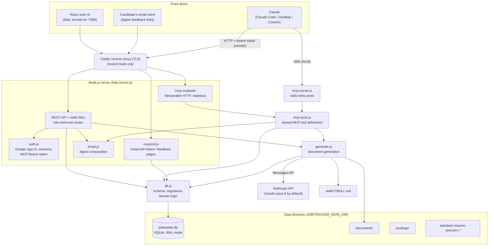
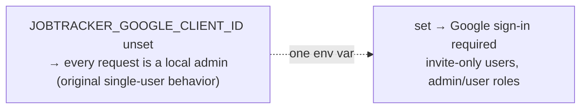
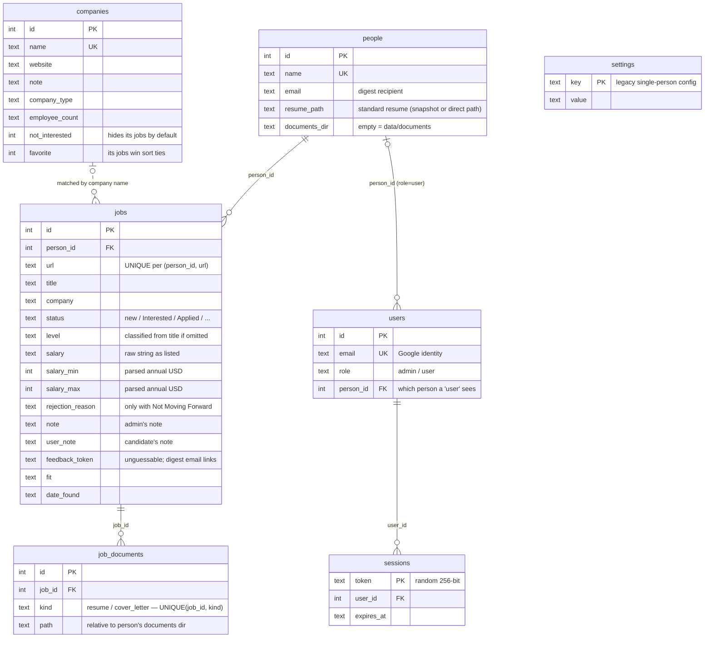
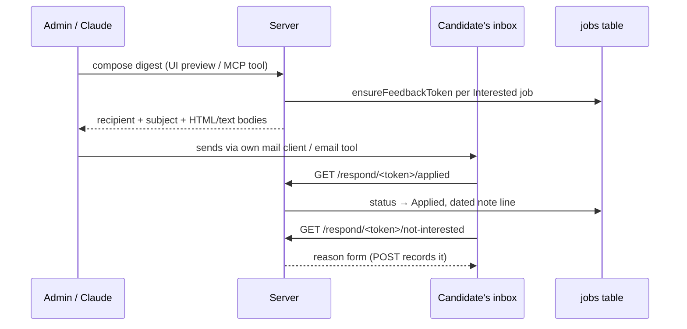
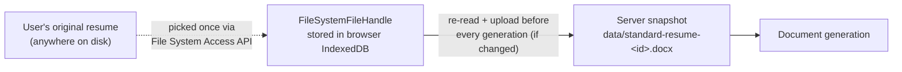
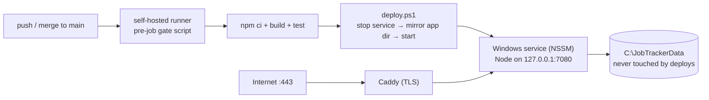

# JobTracker Architecture

This document explains how JobTracker is put together and, more importantly, **why** it is put together that way. Most of the design falls out of one governing constraint:

> **This is a local-first tool that scales to one household.** It runs fully on one machine with no accounts and no network exposure — and can *optionally* be hosted for a few invited users (family members) behind Google sign-in. The hosted mode is strictly additive: with no auth configured, the app behaves exactly as the original single-user local tool.

Nearly every architectural choice below — SQLite over a server database, polling over websockets, a hand-rolled router over Express, inline migrations over a framework — is the simplest option that satisfies that constraint. Where the app *does* take on real complexity (Word-document generation, the resume-sync mechanism, the auth/role layer, the hardened self-hosted CI runner), it's because the problem genuinely demands it.

## System overview

The system has **one data store and three front doors**. The SQLite database is the integration point; everything else is a client of it.



Key properties:

- **The stdio MCP server and the web server are independent processes that never talk to each other.** An update made through either is visible to the other because both read and write the same database file. SQLite's WAL journal mode (set in [db.js](server/db.js)) is what makes this safe — readers don't block the writer and vice versa, so the UI can poll while Claude inserts.
- **All MCP tools live in one module, [mcp-tools.js](server/mcp-tools.js), consumed by two transports:** [mcp-server.js](server/mcp-server.js) is a seven-line stdio entry point for local use, and the web server exposes the identical tools at `/mcp` over Streamable HTTP for remote use. One definition, two front doors — the same philosophy as sharing db.js between HTTP and MCP.
- **Auth is an opt-in layer, not a rewrite.** Setting `JOBTRACKER_GOOGLE_CLIENT_ID` turns on sign-in; without it, every request acts as a local admin and the app is its original single-user self ([auth.js](server/auth.js)). This keeps the local dev/single-user path zero-config while letting the same codebase run hosted.

## Module responsibilities

| Module | Role | Depends on |
|---|---|---|
| [server/db.js](server/db.js) | Schema, migrations, and **all domain logic** (validation, salary parsing, level classification, dedup rules, users/sessions, feedback tokens) | `node:sqlite`, `node:crypto` |
| [server/http-server.js](server/http-server.js) | REST API with per-route role enforcement, static files, `/mcp`, request routing | db.js, generate.js, auth.js, email.js, respond.js, mcp-tools.js |
| [server/auth.js](server/auth.js) | Google ID-token verification, session cookies, MCP bearer-token check | db.js, `node:crypto` |
| [server/mcp-tools.js](server/mcp-tools.js) | MCP tool definitions (Zod schemas) mapped onto db.js/generate.js/email.js | db.js, generate.js, email.js, MCP SDK |
| [server/mcp-server.js](server/mcp-server.js) | Thin stdio entry point around mcp-tools.js | mcp-tools.js |
| [server/generate.js](server/generate.js) | Tailored resume/cover-letter generation via the Anthropic API | db.js, Anthropic SDK, mammoth, jszip |
| [server/email.js](server/email.js) | Composes (never sends) the Interested-jobs digest email | db.js |
| [server/respond.js](server/respond.js) | Candidate-facing `/respond/<token>` feedback pages | db.js |
| [web/src/](web/src/App.jsx) | React SPA — presentation and optimistic editing only | `/api` REST endpoints |
| [scripts/](scripts/import-html.mjs) | Legacy importer, auth/role/MCP smoke test, deploy + runner-hardening scripts | — |
| [skills/](skills/tailored-resume/SKILL.md) | Prompt instructions for document generation, as editable Markdown | — |

### Why domain logic lives in db.js

`db.js` is not just a data-access layer — status validation, seniority-level classification, salary parsing, the "clear rejection_reason when leaving Not Moving Forward" rule, per-person URL dedup, and user/session management all live there. This was deliberate: **there are multiple independent entry points (HTTP, stdio MCP, remote MCP, respond pages), and any rule implemented in a route handler would exist in one and not the others.** Pushing every rule down into the shared module means all front doors get identical behavior for free, and the route/tool layers stay thin adapters (parse input → check role → call function → serialize output).

## Technology choices and rationale

### SQLite via `node:sqlite` (no ORM, no native modules)

- **Why SQLite:** a handful of users, one machine, moderate data volume. A single file is trivially backed up (copy it), survives without a running service, and supports the multi-process access pattern via WAL. Even the hosted deployment stays comfortably within SQLite's write capacity. A client-server database would add operational burden for zero benefit here.
- **Why `node:sqlite` (built-in) instead of `better-sqlite3`:** no native compilation step on install — `npm install` works on a fresh Windows machine without build tools. The built-in module's synchronous API is also a *feature* at this scale: every query is a local file read measured in microseconds, so async plumbing would add ceremony without concurrency benefit.
- **Why no ORM:** the schema is seven tables. Hand-written prepared statements are shorter than model definitions would be, and dynamic UPDATE construction (see `updateJob`) covers the "patch arbitrary fields" need directly.

### Inline, idempotent migrations

Migrations run at module load in [db.js](server/db.js): each one checks `PRAGMA table_info` for a missing column (or `CREATE TABLE IF NOT EXISTS`) and applies itself only when needed. There is no migration framework, no version table, no down-migrations.

- **Why:** with a handful of databases in the wild (the user's own machines plus the hosted deployment), the only requirement is "old databases upgrade themselves on next start" — which also makes deploys migration-free: the service restarts and the schema is current. Idempotent checks satisfy that with zero infrastructure. Migrations also **backfill** (e.g. classifying levels for pre-existing rows, parsing salary ranges from stored strings) so new features immediately work on old data.
- The most involved migration — adding `person_id` — rebuilds the jobs table (SQLite can't alter a UNIQUE constraint), moving URL uniqueness from global to **per person** so two people can track the same posting independently.

### Hand-rolled HTTP server on `node:http`

[http-server.js](server/http-server.js) uses no Express/Fastify — just `node:http`, a URL parse, and a chain of `if` route matches.

- **Why:** the API is a few dozen routes with uniform JSON handling. A framework would add a dependency tree to save perhaps 50 lines. Fewer dependencies matter more than usual here because this app is meant to keep working, untouched, for years.
- **Routing order encodes the auth model** ([http-server.js:628-649](server/http-server.js:628)): `/mcp` has its own bearer-token check; `/api/auth/*` and `/respond/*` work without a session (sign-in itself, and the tokenized candidate links); every other `/api` route requires a signed-in user; static files stay public because the SPA shell *is* the sign-in page.
- **Network posture:** the server binds to `127.0.0.1` by default; in the hosted deployment it stays on localhost and Caddy is the public TLS listener. Path checks guard static serving and document serving (path-traversal), and the `/api/local-file` endpoint — which reads arbitrary `file://` URLs — only serves a file if that exact URL is a tracked job's posting URL (a non-admin's *own* job's URL). That check is what stops the endpoint from being a generic local-file reader.
- `server.requestTimeout = 0` because document generation legitimately holds a request open for minutes; Node's default 300s timeout would kill it mid-generation.

### MCP: one tool set, two transports

- **Stdio for local** ([.mcp.json](.mcp.json) registers it for this repo; Claude Desktop config elsewhere): the MCP client spawns the process itself, so there's no port to manage and no auth story needed — it talks straight to the local database, web server or not.
- **Streamable HTTP for remote** (`/mcp` on the web server): lets Claude sessions on any machine reach the hosted tracker. It is guarded by a single static bearer token (`JOBTRACKER_MCP_TOKEN`, compared with `timingSafeEqual`), disabled entirely when the token is unset, and **stateless** — each POST gets a fresh server + transport, so there is no session bookkeeping to leak or expire. A static token was chosen over OAuth deliberately: there is exactly one authorized MCP caller (the admin), and full OAuth would be a lot of machinery to protect one credential the admin already controls.
- **Why rich Zod descriptions:** the tool schemas double as the model-facing documentation. Descriptions embed the valid enums (statuses, levels, rejection reasons, company types) so Claude sends canonical values without a round trip; `normalizeLevel`/`normalizePreset` in db.js then forgive near-misses ("sr. manager" → "Senior Manager") rather than erroring.
- **Design-for-idempotence:** `add_jobs` skips URLs the person already tracks (`ON CONFLICT(person_id, url) DO NOTHING`) so a daily Claude job can blindly re-send everything it finds without clobbering statuses and notes. This one decision is what makes the automation safe to run unattended.

### React + Vite frontend, served as static files

- Vite builds `web/` into `dist/`; the Node server serves it with an SPA fallback. In development, Vite's dev server proxies `/api` to :7080 ([vite.config.js](vite.config.js)) so both modes hit the same backend.
- **Why polling (30s) instead of websockets:** the other writers are Claude via MCP and, at most, a couple of family members; a half-minute staleness window is imperceptible for a job tracker. Polling costs one cheap query per 30s.
- **Why no state library / router:** the app is one main view plus dialogs. `useState` in [App.jsx](web/src/App.jsx) with filters persisted to `localStorage` covers it. Edits are applied optimistically and reconciled by the next refresh.

## Authentication and roles

Auth was added for the hosted deployment and designed to disappear when unused:



- **Google Identity Services ID tokens, verified in-process.** The web UI gets a signed JWT from Google's sign-in button; the server verifies its signature against Google's published JWKS using `node:crypto` — no OAuth redirect flow, no client secret, and **no new dependencies** ([auth.js](server/auth.js)). The public client id doubles as the `aud`-claim gate on which tokens are accepted.
- **Invite-only, with a lockout escape hatch.** A successful Google sign-in only works if the email already exists in the `users` table (invited by an admin) — except emails in `JOBTRACKER_ADMIN_EMAILS`, which self-provision as admins on first sign-in, so a fresh deployment is never locked out.
- **Sessions are SQLite-backed HttpOnly cookies** (30-day expiry, opportunistic cleanup on creation) rather than signed stateless tokens — revocation is a row delete, and the database is already right there.
- **Two roles, enforced per-route, scoped by data ownership.** A `user` account is linked to one person and is hard-scoped to that person's world: their own jobs (whatever filters they request), a restricted field set on edits (`status`, `rejection_reason`, `user_note` — the admin's `note` stays read-only to them), favorites-only on companies, and their own documents. Admin-only surfaces: filesystem endpoints (browse/upload), people/settings/user management, the email digest, and job deletion. Two details worth noting:
  - Ownership misses return **404, not 403**, so one user's job/document ids aren't confirmed to exist to another.
  - Admins cannot demote or delete their own signed-in account — the deployment can't be locked out by a misclick.
- **`user_note` exists because of roles:** the original `note` column became the admin's; candidates got their own column rather than a shared free-for-all field, so neither side can clobber the other.

## Data model



Notable modeling decisions:

- **Companies are joined by name, not foreign key.** Jobs arrive from an LLM with a free-text company name; forcing FK integrity would require an upsert-and-resolve step on every insert for little gain. Instead, `listCompanies()` synthesizes the company list from `GROUP BY company` over jobs, overlaid with any saved `companies` rows — so a company "exists" the moment a job mentions it, and saving a note upserts the row lazily. The cost is that renaming a company on its jobs orphans its saved info; acceptable at this scale.
- **Both raw and parsed salary are stored.** `salary` keeps exactly what the posting said (for display and trust); `salary_min`/`salary_max` are best-effort parsed annual figures (for sorting/filtering). `parseSalary` deliberately returns nulls for anything untrustworthy — hourly rates, "Competitive" — so the UI falls back to the raw string rather than showing a wrong number. Explicit values from a caller always beat the parser.
- **`job_documents` stores relative paths** (forward-slashed) under the person's documents directory, so the whole documents tree can be relocated by changing one setting, and the DB file stays portable across machines.
- **`people` and `users` are distinct concepts on purpose.** A person is a *candidate whose jobs are tracked*; a user is a *web account*. An admin tracks jobs for people who may never sign in, and linking a user to a person is an explicit admin action — conflating the two would force every candidate to have a Google account.
- **The `settings` table is vestigial** — it held single-person config before the `people` migration, and is read once to seed the first person.

### Multi-person support

The app tracks multiple candidates (e.g. family members). The design threads one `person` concept through every layer rather than partitioning databases:

- Each job belongs to a person; URL uniqueness is per person.
- Resume path, documents folder, and digest email address are **per-person columns on `people`**, not global settings — generation for a job always uses the config of the job's owner.
- MCP tools take an optional `person` argument (name or id) resolved by `resolvePerson`, which is only allowed to be omitted while exactly one person exists — the "just works" single-user case stays frictionless, and ambiguity is an explicit error rather than a silent guess.

## Document generation

This is the most complex subsystem, and each piece of complexity is there to hit a specific quality bar: **generated documents must look like the user's real resume and must never fabricate their history.**

```mermaid
sequenceDiagram
    participant C as Caller (UI button / MCP tool)
    participant G as generate.js
    participant DB as db.js
    participant A as Anthropic API (claude-opus-5 by default)
    participant FS as documents dir

    C->>G: generateJobDocuments(job)
    G->>DB: job + owning person + company info
    G->>G: load skills/*/SKILL.md (instructions)
    G->>G: resumeSource(person)
    Note over G: .docx → unzip, extract document.xml + styles.xml<br/>PDF → document block; text/md → text block
    G->>A: resume call — resume + job context (cached blocks)<br/>+ skill + output-format instruction
    Note over A: http(s) posting fetched by the model<br/>via web_fetch (max 3 uses)
    A-->>G: new word/document.xml (or Markdown)
    G->>G: validate XML well-formedness<br/>(one retry with the error as feedback)
    G->>FS: repackage into copy of original .docx, save
    G->>A: cover-letter call — same context<br/>+ tailored resume as plain text
    A-->>G: cover letter
    G->>FS: save
    G->>DB: upsert job_documents rows
    G-->>C: result (paths / error)
```

The rationale behind the main pieces:

- **The `.docx` template trick.** Rather than generating a document from scratch (generic-looking) or using a templating library (rigid), the model is given the resume's own `word/document.xml` as both content source and formatting reference, and asked to write a replacement `document.xml` reusing the original's style references, numbering ids, and section properties. The output is zipped back into a **copy of the original file**, so every style, font, header, and relationship the XML references still resolves. Generated documents are visually indistinguishable from the user's own resume ([generate.js](server/generate.js)).
- **Validation gate with one retry.** Word refuses malformed XML outright, so `docXmlProblem` checks well-formedness with `fast-xml-parser` before packaging; a failure feeds the parser error back to the model for one retry. This converts the most likely failure mode from "user opens a broken file" into "generation takes one extra call."
- **Skills as editable Markdown.** The writing instructions live in [skills/tailored-resume/SKILL.md](skills/tailored-resume/SKILL.md) and [skills/tailored-cover-letter/SKILL.md](skills/tailored-cover-letter/SKILL.md), loaded at generation time. The user can change *how documents are written* without touching code — the same philosophy as Claude's own skill system. An optional `model:` key in a skill's frontmatter overrides the default model (`claude-opus-5`) for that document type.
- **Anti-fabrication and prompt-injection defenses in the system prompt.** The standard resume is declared the single source of truth (never invent employers, dates, metrics), and the job posting is explicitly framed as *data, not instructions* — a real concern, since postings are arbitrary web content fed into the prompt.
- **Prompt caching and call ordering.** The resume block and job-context block carry `cache_control` breakpoints; the instruction comes last. So the second call (cover letter) reuses the cached prefix of the first. The cover-letter call receives the just-written resume as **plain text** rather than XML — enough for consistency at a fraction of the tokens.
- **Streaming + `pause_turn` loop.** Responses stream to avoid HTTP timeouts on multi-minute generations, and the loop continues through `pause_turn` stop reasons (which web_fetch produces). A server-side fallback to `claude-opus-4-8` covers model unavailability.
- **The API key is never stored.** The SDK resolves credentials from the environment at request time; the settings API only reports *whether* credentials were found.

## The digest email and candidate feedback loop

[email.js](server/email.js) and [respond.js](server/respond.js) close the loop between the tracker and a candidate who never opens the UI:



- **The app composes but never sends email.** Sending would mean SMTP credentials, deliverability, and provider config; composing hands a ready-made message (recipient, subject, rich HTML + plain text) to whatever the admin already has — a compose window via clipboard, or Claude via a connected email tool.
- **Feedback links are capability URLs.** Each job gets a lazily-minted, unguessable `feedback_token` (128-bit random, unique-indexed); `/respond/<token>/<action>` needs no login and can change nothing beyond that one job's status/reason/note. This is deliberate least-privilege: the candidate clicks a link on their phone, and the worst a leaked link can do is mis-flag one job — every change also appends a dated `[email feedback]` line to the note, so nothing happens silently.
- **GET semantics match email-client reality.** Mail clients only GET, so the two safe actions (applied / still interested) record on GET, while "not interested" — which needs a reason — shows a form and records on its POST. The handlers are also written to be re-click-safe: an "applied" link on an already-Applied job changes nothing, and "still interested" never drags an advanced job (Applied, Interviewing…) back to Interested.

## The resume-snapshot / file-link mechanism

A quiet but subtle piece of design in [web/src/resumeLink.js](web/src/resumeLink.js) solves a browser-imposed problem: **the server needs to read the user's resume file, but browsers never reveal real file paths.**



- When the user picks or drops their resume, the browser uploads the bytes and the server stores a **managed snapshot** (`data/standard-resume-<person>.<ext>`), pointing the person's `resume_path` at it. The server can now always read the resume — but a snapshot alone would go stale.
- So the UI *also* keeps the `FileSystemFileHandle` to the original file in IndexedDB (Chrome/Edge). Before each generation it re-reads the original through the handle and re-uploads if `lastModified` changed — the user edits their real resume and the app silently stays current. The handle survives reloads; after a browser restart the first sync may need a one-click permission grant.
- Escape hatches preserve simplicity for other cases: typing a literal path into Settings bypasses the whole mechanism (the server reads that file in place), and the sync is skipped whenever `resume_path` no longer points at the managed snapshot.

The same "server keeps a copy" idea applies to job postings dragged onto the UI: `/api/upload-posting` stores the file under `data/postings/` and tracks the copy's `file://` URL, so the posting survives the original being moved or deleted. And because browsers refuse `file://` links from an http page, the UI (and digest emails) open local postings through `/api/local-file` — gated, as noted above, to URLs that are actually tracked by a job the requester may see.

## Deployment and CI/CD

The hosted mode (fully described in [docs/deployment.md](docs/deployment.md)) keeps the app itself unchanged and layers infrastructure around it:



The decisions worth understanding:

- **App directory and data directory are strictly separated.** Deploys wipe and rewrite the app dir; `JOBTRACKER_DATA_DIR` points at a directory `deploy.ps1` never touches. Combined with self-applying migrations, a deploy is just "replace code, restart service."
- **TLS is Caddy's job, not the app's.** The Node server stays a plain-HTTP localhost listener in every mode; Caddy terminates TLS (with automatic Let's Encrypt) and proxies. The app's only concession is reading `x-forwarded-proto` to set the session cookie's `Secure` flag correctly.
- **The self-hosted runner is treated as the main attack surface.** A self-hosted runner on a public repo is dangerous (fork PRs can submit arbitrary workflows), so three independent layers guard it: a **pre-job gate script** installed *outside the repo* (so a PR can't rewrite it) that rejects any job that isn't a push to `main` of this repo by an allowed actor, before even checkout runs; a **dedicated low-privilege account** with write access only to the app and runner dirs — pointedly *not* the data dir; and **repo settings** (fork-PR approval required, protected `main`). PR CI runs on GitHub-hosted runners so untrusted code never reaches the machine.
- **Testing is a deployed-surface smoke test, not a unit suite.** [scripts/test-auth.mjs](scripts/test-auth.mjs) (`npm test`) boots the server and drives ~37 checks over the surfaces where a regression is dangerous rather than cosmetic: auth gating, role scoping, and MCP token enforcement. The highest-risk generation path (docx XML) is guarded by its runtime validation gate instead.

## Cross-cutting conventions

- **Lenient in, canonical out.** Anywhere an LLM or human supplies an enum-ish value (level, company type, employee count), a normalizer maps near-misses to the canonical preset and passes unrecognized values through as free text rather than rejecting them. Validation hard-fails only where correctness demands it (unknown person, invalid status, invalid role).
- **Derived data is computed at write time, not read time.** Level classification and salary parsing happen on insert/update and are stored, so list queries stay simple and fast, and a misclassification can be corrected by hand without being overwritten on the next read.
- **Deletes are conservative.** Deleting a job removes its DB rows but leaves generated files on disk; deleting a person requires them to have no jobs; deleting a user also deletes their sessions; the MCP `delete_job` description steers Claude toward status changes instead of deletion.
- **Sorting encodes preference, not just order:** newest first, favorite companies win ties within a date, then company/id — implemented in SQL so the UI, the API, and MCP all agree.
- **Secrets live in the environment, never the database:** the Anthropic key, the Google client id, the MCP token, and the admin-email seed list are all env vars; the DB stores no credential material beyond random session/feedback tokens it minted itself.

## What was deliberately left out

| Not present | Why |
|---|---|
| Passwords / a homegrown identity system | Google sign-in delegates credential storage entirely; the app only ever sees a verified email. And with no client id set, there's no auth at all — local mode needs none |
| OAuth for the MCP endpoint | One authorized caller (the admin); a static bearer token compared in constant time is the right-sized mechanism |
| Email sending (SMTP) | Composing is the hard, valuable part; sending is delegated to the admin's own mail client or Claude's email tooling |
| TypeScript / build step for the server | Server files run directly under Node; typing wasn't worth a compile step at this size |
| Unit-test suite | Replaced by a deployed-surface smoke test (`npm test`) covering auth/roles/MCP — the places where silent regressions are dangerous |
| WebSockets / SSE | 30s polling is imperceptibly stale for this workload |
| ORM / migration framework / web framework | Each replaced by a few dozen lines with zero dependencies (see above) |
| Docker / cloud hosting | The deployment target is a Windows box the admin owns; NSSM + Caddy + a deploy script cover it without a container layer |

The general rule: infrastructure earns its place only when the local-first premise stops covering the need. The Anthropic API, Google sign-in, and the hardened CI runner each crossed that bar; everything else stayed simple on purpose.
